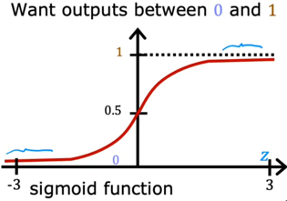

# week1 单变量线性回归模型
>举例：波特兰房价与面积之间的关系
## 1.1单变量线性回归模型
单变量线性回归模型如下式
$$
f_{w,b} (x)=wx + b
$$
式中，$w$和$b$为参数
**代价函数**
$$
J(w, b)=\frac{1}{2m}\sum_{i=1}^m\left( \hat y^{(i)} - y^{(i)}\right)^2
$$
式中$\hat y^{(i)}$和$y^{(i)}$为表示第$i$个训练样本预测值和实际值$\hat y^{(i)}=f_{w,b}(x^{(i)})$，$m$为训练样本的个数，$L=\left( \hat y^{(i)} - y^{(i)}\right)^2$称作损失函数。

可视化代价函数：以波特兰房价预测为例

## 1.2单变量线性回归模型的梯度下降算法

**目标**：获得最小的代价函数，即$\min\limits_{w,b}J(w,b)$
**方法**：给定一个初始的$w,b$，对$w,b$不断更新使得$J(w,b)$不断减小，直到接近最小值

**实现**：
$$
w = w - \alpha \frac {\partial }{\partial w}J(w,b)\\
b = b - \alpha \frac {\partial }{\partial b}J(w,b)\\
$$
其中$\alpha$为**学习率**
$$
\begin{align*}
\frac {\partial }{\partial w}J(w,b) =& \frac{1}{m} \sum_{i = 1}^{m}\left(f_{w,b}(x^{(i)})-y^{(i)}\right)x^{(i)} \\
\frac {\partial }{\partial b}J(w,b) =& \frac{1}{m} \sum_{i = 1}^{m}\left(f_{w,b}(x^{(i)})-y^{(i)}\right) 
\end{align*}
$$
## 1.3学习率对梯度下降算法的影响
$\alpha$太小，梯度下降算法执行缓慢

$\alpha$太大，无法收敛，甚至发散

>固定学习率会使得代价函数$J(w,b)$取得局部最小值
>
# week2 多元线性回归模型

## 2.1多元线性回归模型

$$
f_{\vec w,b}(\vec x)=w_1x_1+w_2x_2+w_3x_3+…+b
$$

**代价函数**

$$
J(\vec w,b)=\frac 1{2m} \sum_{i=1}^{m}\left (f_{\vec w,b}\left (\vec x^{(i)}\right) - y^{(i)}\right)^2
$$
>向量化
>使用向量点乘代替循环，以提高代码的运行效率，使用Numpy库，使用方法见实验C1_W2_Lab01
## 2.2 多元线性回归的梯度下降法
与单变量线性回归的梯度下降法类似
**实现**：

$$
w_j= w_j - \alpha \frac {\partial }{\partial w_j}J(\vec w,b)
$$

$$
b = b - \alpha \frac {\partial }{\partial b}J(\vec w,b)\\
$$

其中$\alpha$为**学习率**

$$
\begin{align*}
\frac {\partial }{\partial w_j}J(\vec w,b) =& \frac{1}{m} \sum_{i = 1}^{m}\left(f_{w,b}(\vec x^{(i)})-y^{(i)}\right)x^{(i)}_j \\
\frac {\partial }{\partial b}J(w,b) =& \frac{1}{m} \sum_{i = 1}^{m}\left(f_{w,b}(\vec x^{(i)})-y^{(i)}\right) 
\end{align*}
$$
>正规化方法 (Normal equation)是一种可以选择的方法，该方法可以一次性求出$w,b$的最优解，但是仅适用于线性回归，并且在特征数量很多的时候运行很慢。(没学会
## 2.3 特征缩放
### 2.3.1 特征缩放引入
案例：房价
$$
\widehat {price}=w_1x_1+w_2x_2+b
$$
其中$x_1$是房子面积，$x_2$是房间数量。然而$x_1$通常取值比$x_2$大很多，因此其参数可能也会相差很大。

当特征取值范围相差很大时，会影响梯度下降算法，如下图：

### 2.3.2 特征缩放方法
**1.平均值标准化方法 (Mean Normalization)**
$$
x=\frac {X - X_{Mean}}{X_{Max} - X_{Min}}
$$
式中$X_{Mean}$为特征的平均值
此方法将特征映射到$(-1,1)$之间
**2.Z值标准化方法(Z-score Normalization)**
$$
x=\frac {X-X_{Mean}}\sigma
$$
始终$X_{Mean}$为特征的均值，$\sigma$为标准差
此方法规范化后取值范围在0上下波动
>缩放范围
>
## 2.4 判断梯度下降是否收敛
一种方法是使用**学习曲线 (learning curve)** 判断梯度下降算法是否有效
如图为一个学习曲线，横坐标为迭代次数，纵坐标为代价函数。

还有一种方法是**收敛性检测(Automatic convergence test)**
例如使$\varepsilon <0.001$，若在一次迭代之后$J(\vec w,b)$减少量小于$\varepsilon$，则认为其收敛。
**正确设置学习率**
当梯度下降函数运行效果不佳时，可能是学习率有问题或者程序出错。
若程序没有问题，可以根据学习曲线尝试不同学习率。

## 2.5 特征工程
根据直觉通过转换或者结合现有特征，来引入新的特征。

**多项式回归**
引入原始特征的次方项，要进行特征缩放。
# week3 分类
## 3.1 逻辑回归
>线性回归无法很好解决分类问题，引入逻辑回归

**线性回归**：
$$
z=\vec w \cdot \vec x+b
$$
**sigmoid函数：**
$$
g(z)=\frac 1 {1+e^{-z}}
$$

**逻辑回归假设函数：**
$$
\begin{align*}
f_{\vec w,b}(\vec x)&=g(\vec w \cdot \vec x+b)\\
&=\frac 1 {1+e^{-\left(\vec w \cdot \vec x+b\right)}}\\
&=P(y=1|\vec x;\vec w, b)
\end{align*}
$$
函数值在$(0,1)$之间，表示输出为1的概率。
**决策边界：**
举例：若阈值为0.5，则$f_{\vec w,b}(\vec x)>0.5$时，$\hat y=1$；反之，$\hat y=0$；
此时决策边界为$\vec w \cdot \vec x+b=0$。

## 3.2 逻辑回归代价函数
若使用线性回归中的代价函数
$$J(\vec w,b)=\frac 1{2m} \sum_{i=1}^{m}\left (f_{\vec w,b}\left (\vec x^{(i)}\right) - y^{(i)}\right)^2$$
会导致代价函数不是一个凸函数，为保证梯度下降法能够寻找出全局最小值，需要重新寻找合适的代价函数。
>如果不是凸函数，会梯度下降法可能会停在局部最小值的点上

**逻辑回归损失函数**
$$
L\left(f_{\vec w,b}(x^{\left(i\right)}),y^{(i)} \right)=\begin{cases}
-\log \left(f_{\vec w,b}(x^{\left(i\right)})\right), & \text{if }y^{(i)}=1\\
-\log \left(1-f_{\vec w,b}(x^{\left(i\right)})\right), & \text{if }y^{(i)}=0
\end{cases}
$$

**逻辑回归代价函数**
$$
J(\vec w,b)=\frac 1{m}\sum_{i=1}^{m}L\left(f_{\vec w,b}(x^{\left(i\right)}),y^{(i)} \right)
$$
>此代价函数是由最大似然估计推导得到。（未查证）

**简化逻辑回归代价函数**
$$
\begin{align*}
J(\vec w,b)&=\frac 1{m}\sum_{i=1}^{m}L\left(f_{\vec w,b}(x^{\left(i\right)}),y^{(i)} \right)
\\&=-\frac 1{m}\sum_{i=1}^{m}\left[y^{(i)}\log \left(f_{\vec w,b}(x^{\left(i\right)})\right)+(1-y^{(i)})\log \left(1-f_{\vec w,b}(x^{\left(i\right)})\right)\right]
\end{align*}
$$
sdfasfdsa